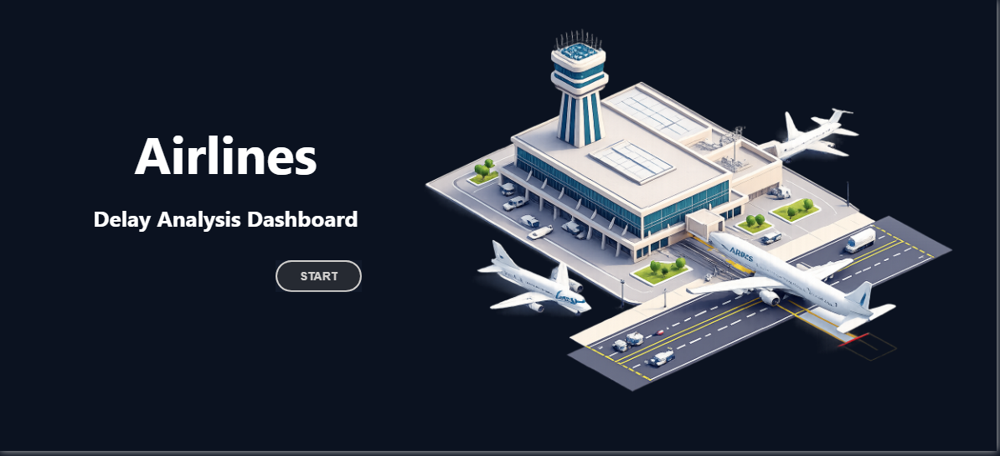
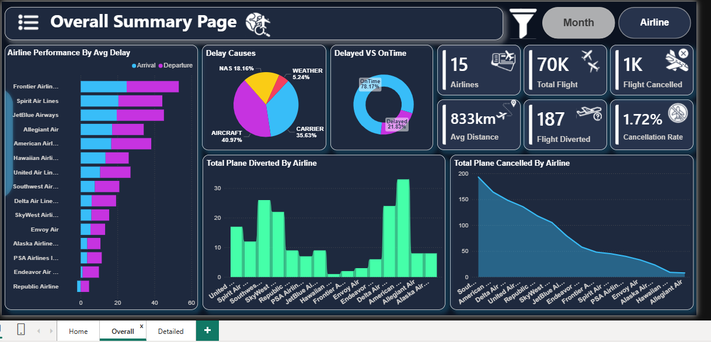
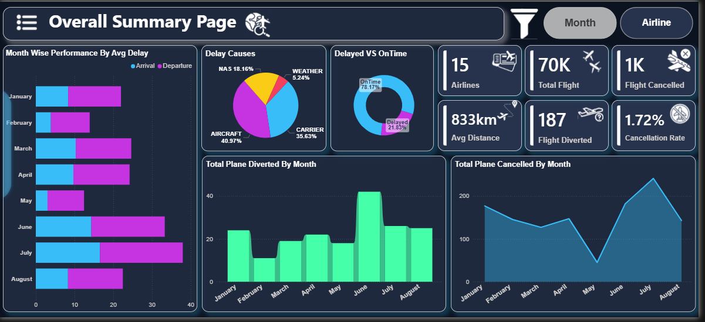
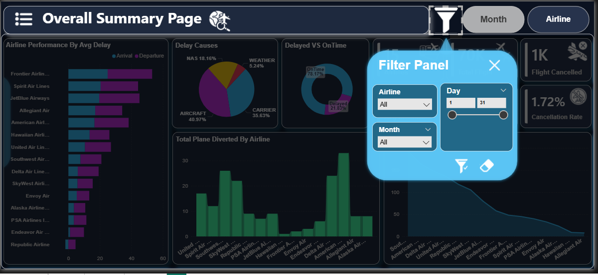
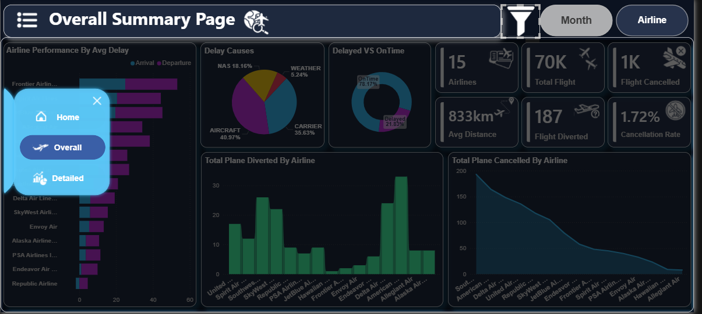
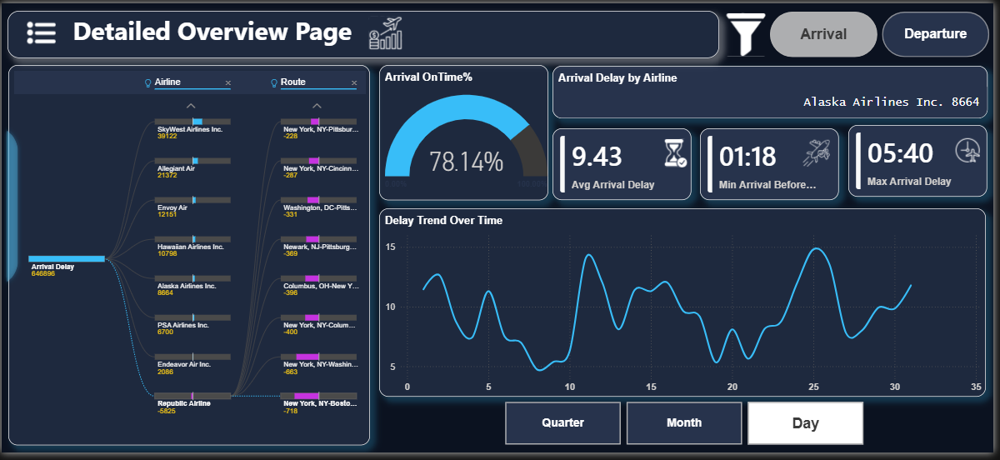
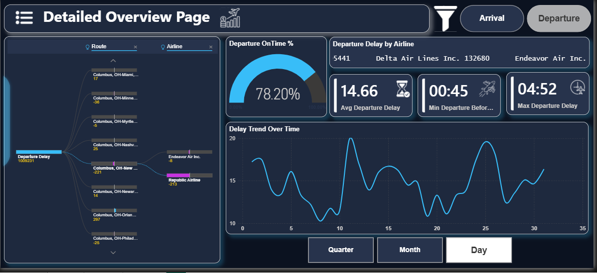

# ✈️ Airlines Delay Analysis Dashboard (Power BI)

## 📊 Project Overview

This project is an **interactive Airlines Delay Analysis Dashboard** built using **Power BI** to analyze airline performance, delays, cancellations, and operational efficiency.

The dashboard helps stakeholders identify trends, uncover delay causes, and make data-driven decisions.

---

## 🎯 Objectives

* Analyze flight delays and on-time performance
* Identify major delay causes
* Compare airline and monthly performance
* Perform route-level deep-dive analysis
* Enable interactive and dynamic reporting

---

## 🧑‍💼 End Users

* Airline Operations Managers
* Airport Authorities
* Business Analysts
* Route Planning Teams
* Senior Management

---

## 🧩 Key Features

### 🔹 Interactive Navigation

* Page Navigator to switch between pages
* Toggle buttons:

  * **Airline vs Month view** (Overall Summary)
  * **Arrival vs Departure view** (Detailed Page)

---

### 🔹 Filter Panel

* Custom filter panel for:

  * Airline
  * Month
  * Day range
* Enables dynamic data exploration

---

### 🔹 KPI Cards

* Total Airlines
* Total Flights
* Flights Cancelled
* Avg Distance
* Flights Diverted
* Cancellation Rate

---

## 📸 Dashboard Screenshots

### 🟦 Home Page



---

### 🟦 Overall Summary (Airline View)



---

### 🟦 Overall Summary (Month View)



---

### 🟦 Filter Panel



---

### 🟦 Navigation Panel



---

### 🟦 Detailed Overview (Departure Analysis)



---

### 🟦 Detailed Overview (Arrival Analysis)



---

## 📊 Visualizations Used

* **Ribbon Chart** → Ranking comparison over time
* **Bar Chart** → Airline performance comparison
* **Pie Chart** → Delay causes distribution
* **Donut Chart** → On-Time vs Delayed flights
* **Line Chart** → Trend analysis (time-series)
* **Area/Column Charts** → Cancellations & diversions
* **Decomposition Tree** → Root cause analysis

---

## 📄 Dashboard Pages

### 🟦 Overall Summary Page

* High-level performance overview
* Airline-wise and Month-wise toggle
* KPI insights and delay breakdown

---

### 🟦 Detailed Overview Page

* Arrival & Departure toggle
* Route-level analysis
* Delay trend over time
* Decomposition Tree for root cause analysis

---

## 🧮 Key Metrics (DAX)

```DAX
OnTime % = (OnTime Flights / Total Flights) * 100

Cancellation Rate = (Cancelled Flights / Total Flights) * 100
```

---

## 🏗️ Data Model

* Star Schema

  * Fact Table: Flight Data
  * Dimension Tables: Airline, Date, Route

---

## 🚀 Tools & Technologies

* Power BI
* DAX
* Data Modeling
* Data Visualization

---

## 💡 Key Insights

* Aircraft issues are the leading cause of delays
* Some airlines consistently underperform
* Seasonal trends show higher delays in certain months
* Specific routes contribute heavily to delays

---

## 🔮 Future Enhancements

* Predictive delay analysis
* Real-time data integration
* Weather data incorporation
* Row-Level Security (RLS)

---

## 👩‍💻 Author

**Iqra Malbari**

---

## ⭐ Conclusion

This dashboard enables both **high-level monitoring** and **detailed analysis**, helping stakeholders improve airline operations and reduce delays.

---
